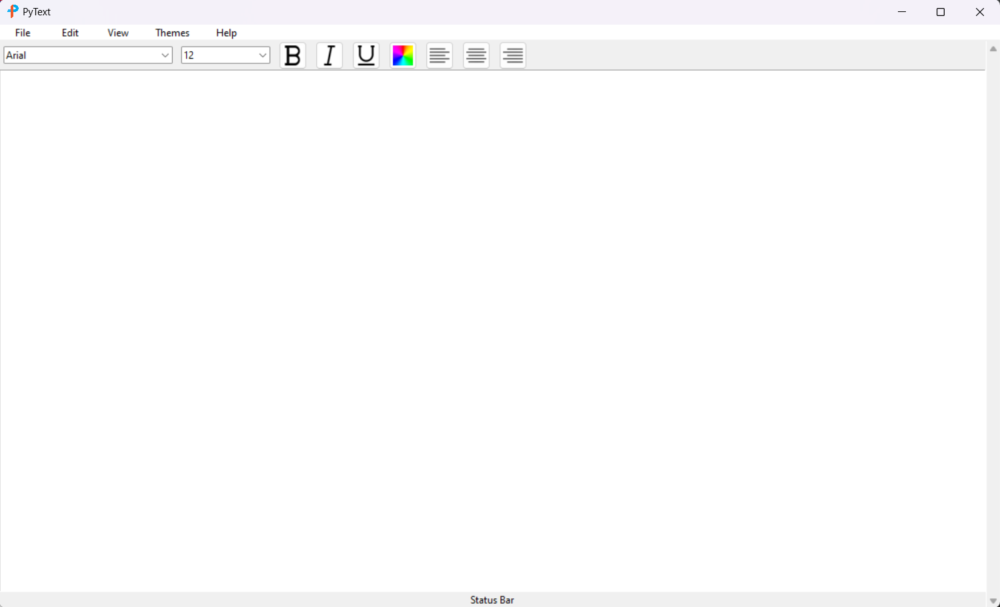

# Pytext

This is inspired by text editors like MS Word and Notepad. 
Pytext can perform basic text operations like cut, copy and paste. It can also perform basic file operations like insert new file, open a file, save a file, and print. This text editor also contains a tool bar where you can select a font, font size, make a text bold, italic, or underlined, and text alignment. It also contains a status bar that provides character and word count. Pytext also has a view menu where you can choose to hide/unhide the toolbar and status bar, a themes menu to choose what color you want the text area to be. 

# Features
- Basic text operations like Cut, Copy, Paste, Undo, Redo, Select All, Clear Find operation that find and replace words, and Time/Date that insert the current time and date.

- Basic file operations like New, Open, Save, Save As, and Print.
- Supports almost all types of files.
- Toolbar that contains Font, Font Size, Bold, Italic, Underline, Text Color, and Text Alignment.
- Status Bar that shows the characters and word count.
- View Menu that hide and unhide the toolbar and status bar.
- Themes Menu that contains different colors for the text area.
- Find operation that find and replace words.
- Time/Date that insert the current time and date.

# Credits
## The unmodified version of this text editor is from [iampiyushjan](https://github.com/iampiyushjain/Text-Editor)
